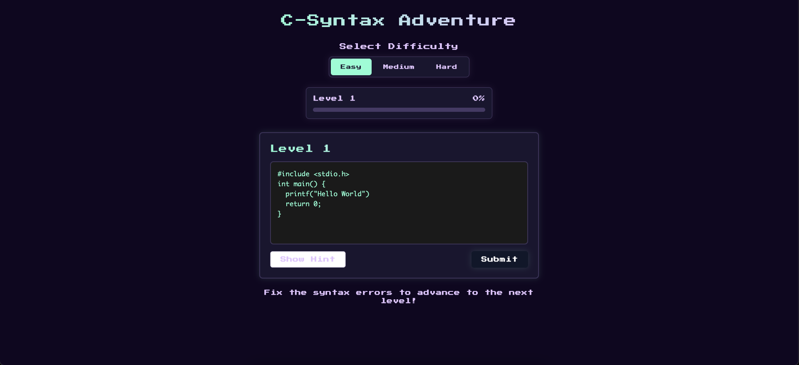

# C-Syntax Adventure 🎮

A retro-themed educational game to learn C programming syntax through interactive challenges.



## 🚀 Features

- **Progressive Difficulty Levels**: Easy, Medium, and Hard challenges
- **Interactive Code Editor**: Real-time syntax checking and feedback
- **Retro UI**: Nostalgic design with modern functionality
- **Helpful Hints**: Built-in hint system for each challenge
- **Progress Tracking**: Visual progress bar to track your advancement
- **Celebration Effects**: Special effects when completing challenges

## 🛠️ Tech Stack

- React + TypeScript
- Vite for build tooling
- Tailwind CSS for styling
- Shadcn/ui for UI components
- React Confetti for celebrations

## 🏃‍♂️ Getting Started

### Prerequisites

- Node.js (v16 or higher)
- npm or yarn

### Installation

1. Clone the repository:
   ```bash
   git clone https://github.com/yourusername/c-syntax-adventure.git
   cd c-syntax-adventure
   ```

2. Install dependencies:
   ```bash
   npm install
   # or
   yarn install
   ```

3. Start the development server:
   ```bash
   npm run dev
   # or
   yarn dev
   ```

4. Open [http://localhost:5173](http://localhost:5173) in your browser

## 🎯 How to Play

1. Select your difficulty level (Easy, Medium, or Hard)
2. Each level presents a C code snippet with syntax errors
3. Fix the errors in the code editor
4. Click "Submit" to check your solution
5. Use hints if you need help
6. Progress through increasingly challenging levels

## 📚 Level Structure

### Easy Mode
- Basic syntax corrections
- Simple semicolon and bracket fixes
- Beginner-friendly challenges

### Medium Mode
- Loop and condition fixes
- Array indexing challenges
- Function syntax corrections

### Hard Mode
- Pointer-related syntax
- Memory management
- Complex structure syntax

## 🎨 Customization

The game features a dynamic theme system that changes based on difficulty:
- Easy: Mint theme
- Medium: Yellow theme
- Hard: Red theme

## 📝 License

This project is licensed under the MIT License - see the [LICENSE](LICENSE) file for details.

## 🙏 Acknowledgments

- Inspired by retro gaming aesthetics
- Built with modern web technologies
- Special thanks to the open-source community

